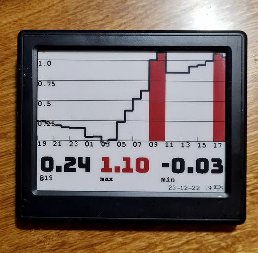
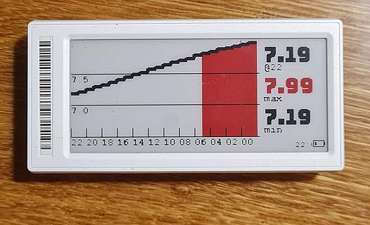
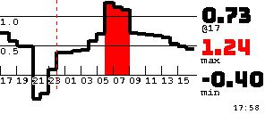
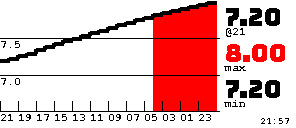

# Various Home Assistant Things

## Zaptec Load Balancing

The Zaptec logic is [documented here](zaptec/README.md).

## AppDaemon

For real. Install Appdaemon and take the time to understand it. A fully working Py environment is so much better to work with than Yaml templating. In all aspects.

https://appdaemon.readthedocs.io/en/latest/index.html

## Open Epaper Displays

https://github.com/jjwbruijn/OpenEPaperLink

https://github.com/jjwbruijn/OpenEPaperLink/wiki

### Nordpool or any Other Input as Charts on Epaper Displays

German river data:

These examples don't need the Epaper integration to be installed, they are pushing images directly to the Epaper access point. 

- [epaper_big_display.py](addon_configs/appdaemon/apps/epaper_big_display.py), renders an image from sensor data to a 400x300 ink display

- [epaper_small_display.py](addon_configs/appdaemon/apps/epaper_small_display.py), renders an image from sensor data to a 296x128 ink display

- [epaper_small_display_wsv_wasser.py](addon_configs/appdaemon/apps/epaper_small_display.py), renders HISTORICAL DATA with a WSV Rest API call to a 296x128 display. It also optionally creates a sensor that can be used for normal operations inside HA

#### Large Display Examples 

#### Small Display Example

German river water levels

#### Setup Nordpool

Your AppDaemon instance needs following extra dependencies:

 - `Pillow`
 - `requests`
 - `datetime`

You need the config in the [apps.yaml](addon_configs/appdaemon/apps/apps.yaml) file and the two TTF font files. They should all be placed in the `apps` folder of your Appdaemon setup. Change the config in the head of the classes to match your AP and display MAC.

In the top of the class you want to use, you need to adjust these settings to match your own setup:

    AP_IP = '192.168.3.130'
    MAC = '000002B3353A3413'
    SENSOR = 'sensor.nordpool_kwh_se3_sek_3_10_025'

If you want to manually trigger a re-render, it is easily made with a script in HA that can be executed in the Developer tools Events sections. Add this to `scripts.yaml`:

    alias: Generate small chart to epaper display
    sequence:
      - event: EPAPER_GENERATE_CHART_SMALL

    alias: Generate large chart to epaper display
    sequence:
      - event: EPAPER_GENERATE_CHART_LARGE

Reload the scripts and then the events can be fired in the Events section.

Please note that the epaper AP is not fast and don't like parallel posts! Make sure to run updates in sequence and not in parallel to avoid corrupt images.

The two classes initialize an hourly update but with a small difference in scheduled time to not interfere with each other. With this small time difference the AP has time to load the images in a safe manner.

#### Setup WSV Water Levels

You need to set all the config values in the header of the `epaper_small_display_wsv_wasser.py` class. Default is Köln/Rhein and it will create a sensor in HA.

Add this in `apps.yaml`:

    epaper_small_chart_wsv_wasser:
      module: epaper_small_display_wsv_wasser
      class: SmallDisplayChartWsvWasser

For manual triggering add a script that fires the event `EPAPER_GENERATE_CHART_WSV_WASSER`. See above or add it via the HA UI.

If you let the class update HA with a sensor, the sensor is easily found as "Water Level".

